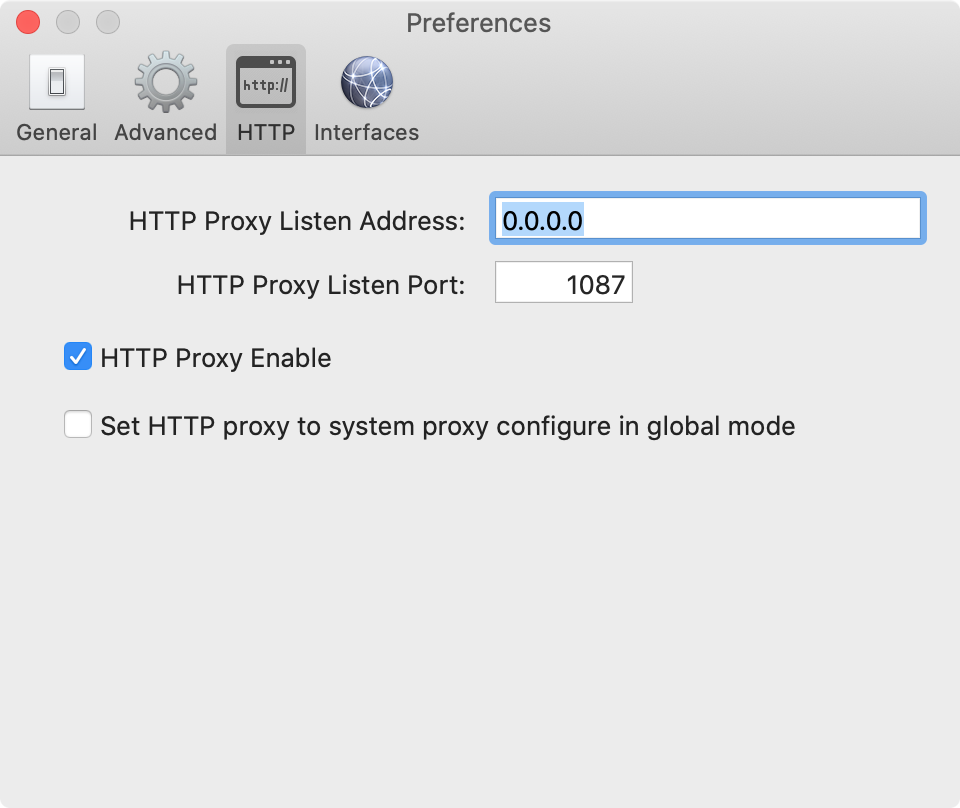

# Using Proxy in Git

## Prerequisite
Pleasure ensure you have a HTTP proxy server in place. I'm using the HTTP proxy server provided from the [Shadowsocks](https://github.com/shadowsocks) client.

## Address and port for the proxy server
Click on your client icon in the menu bar (I'm using macOS) and go the preferences to find out the address and port it's listening on. Refer to the screenshot below.



## Config the proxy for Git
In your terminal and the directory of your Git repository, type below command:

``` shell
git config http.proxy http://0.0.0.0:1087
```
Now it would be working. You can you type below command to see what you have just set for the proxy:

``` shell
git config --list
```
You would see one line that is printed like `http.proxy=http://0.0.0.0:1087`

BTW, if you want to set it globally, use `git config --global` instead.
